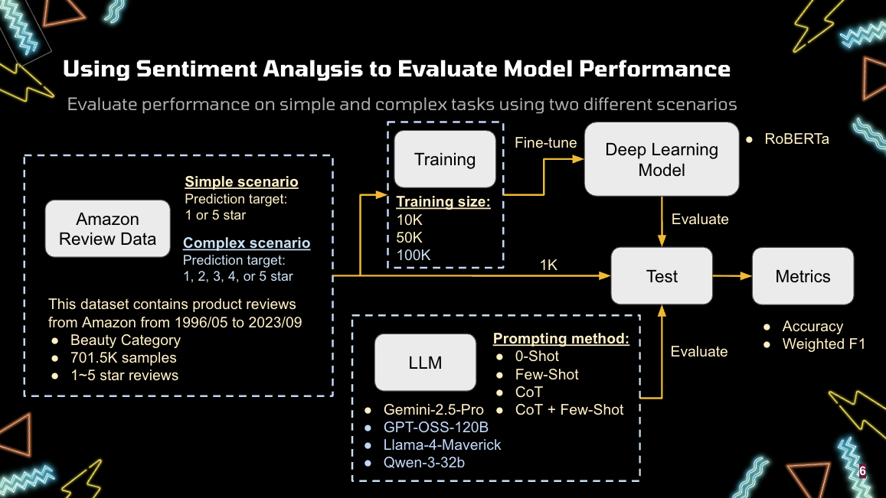

# llm-roberta-sentiment
This is a UW MSDS DATA512 project conducted in Autumn 2025.

## Abstract
The objective of this project is to compare the performance of a fine-tuned BERT model with several large language models (LLMs) on sentiment analysis tasks. Using Amazon Review Data, I simulated two types of sentiment analysis tasks, simple and complex, and evaluated four LLMs (Gemini 2.5 Pro, GPT OSS 120B, Llama 4 Maverick 128E, and Qwen 3 32B) alongside a fine-tuned RoBERTa model. The results show that on the simple task, LLMs and the fine-tuned BERT model perform similarly, with zero-shot LLMs achieving performance comparable to the fine-tuned model. For the more complex task, the fine-tuned BERT model outperforms LLMs when a large amount of training data is available. Prompting also has a notable effect on LLM performance in the sentiment analysis. For models such as Qwen and Gemini benefit from prompting, whereas others do not. For Llama 4 Maverick, excessive prompting can even degrade performance. Analysis of 1-off performance shows that the fine-tuned BERT model provides higher exact prediction accuracy, while LLMs achieve higher approximate prediction accuracy. Despite their capabilities, LLMs are harder to control and less transparent than traditional model-based approaches. The issue can lead to potential challenges for real-world deployment. However, rapid improvements in LLMs may address some of these limitations.

## Data

In this project, I use the [Amazon-Reviews-2023 datasets from McAuley-Lab](https://amazon-reviews-2023.github.io/). This dataset includes three components: user reviews, item metadata, and item links, covering data from May 1996 to September 2023. For this project, I focus on the user reviews dataset, which contains information such as the rating, title, text, user_id, and product_id. The data includes approximately 571.54 million reviews, written by 54.51 million users for 48.19 million products, making it one of the most comprehensive publicly available review datasets. However, due to limited computational resources, I only use the `All Beauty` category. According to [McAuley Lab](https://huggingface.co/datasets/McAuley-Lab/Amazon-Reviews-2023/discussions/1#65eb9951770aa0e25d718bc0), the data is not assigned a formal license, but it should be used for research purposes under ethical guidelines and applicable legal standards.

## Pipeline
<p align="center">
  
</p>

## Usage

To use this repository, you will need to apply for a GEMINI API key from [Google AI studio](https://aistudio.google.com/api-keys) and a GROQ API key from [Groq](https://console.groq.com/keys), and place them in the `/.env` file as GEMINI_API_KEY and GROQ_API_KEY. Without valid keys, you will not be able to run helper_llm_gemini.ipynb and helper_llm_groq.ipynb successfully.

To use the environment for this project, run the following commend on terminal
```{cmd}
conda env create -f environment.yml
conda activate data512_project
```

You may also need to use Google Colab for additional computing resources when fine-tuning the BERT model.

## License
This project is licensed under the MIT License.